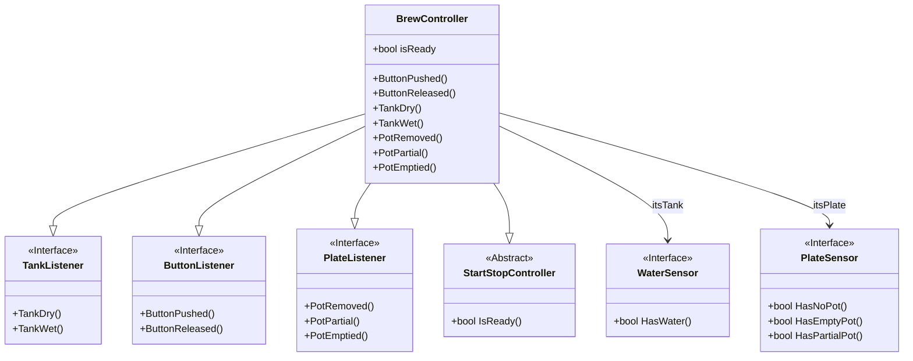

# Example

## TOC

<!-- @import "[TOC]" {cmd="toc" depthFrom=1 depthTo=6 orderedList=false} -->

<!-- code_chunk_output -->

- [Example](#example)
  - [TOC](#toc)
  - [Backlinks](#backlinks)
  - [Footnotes](#footnotes)
  - [Math](#math)
  - [Citations](#citations)
  - [Table](#table)
  - [Mermaid](#mermaid)
    - [Class diagram](#class-diagram)
    - [State diagram](#state-diagram)
  - [Syntax highlighting](#syntax-highlighting)
  - [References](#references)

<!-- /code_chunk_output -->

## Backlinks

This is a [[backlink test]] and it should work.

## Footnotes

This is a footnote[^1] test.

## Math

This is an inline math example: $\int_{\Box}^{\Box} \int_{\Box}^{\Box} f(x, y) dx dy$

And this is a block example:

$$
\int_{\Box}^{\Box} \int_{\Box}^{\Box} f(x, y) dx dy
$$

## Citations

This is taken from that excellent book [@serranoMisMemorias2016]

And also [@monitoTransferenciasInternacionalesCon]

## Table

| Field | Value          |
| ----- | -------------- |
| Title | A simple table |

## Mermaid

### Class diagram



### State diagram

```mermaid
stateDiagram-v2
    LocalOrderSearchDone : LocalOrderSearchDone
    LocalOrderSearchDone : Additional comment
    LocalOrderSearchDone --> CheckingLocalData: NextStep [ order_found_locally() ]
    note right of CheckingLocalData
        The order_found_locally condition means:
        - There's an existent placed order in the database.
    end note
    LocalOrderSearchDone --> RequestingMissingData: NextStep

    RequestingMissingData : RequestingMissingData
    RequestingMissingData : Comentario
    state RequestingMissingData {
        N1 : entry / decide_next_execution()
        N1 --> RequestingBasicDetails: RequestBasicDetails [ basic_details_missing() ]
        N1 --> BasicDetailsRequestDone: RequestBasicDetails
        RequestingBasicDetails --> BasicDetailsRequestDone: BasicDetailsRequestDone
    }
```

## Syntax highlighting

```python
# python.py

class Hello:
    """This is a test class"""
    def __init__(self) -> None:
        pass
```

```typescript
// typescript

class Hello {
    greeting: string;

    constructor(message: string) {
        this.greeting = message;
    }

    greet() {
        return "Hello, " + this.greeting;
    }
}
```

```regex
regex

\(https?:\/\/[^:\/\)]+?\/[^\)](?:[^<:\/\)]+\/)?(?:[^<:\/\)]+\/)?(?:[^<:\/\)]+\/)?(?:[^<:\/\)]+\/)?(?:[^<:\/\)]+\/)?(?:[^<:\/\)]+\/)?(?:[^<:\/\)]+\/)?(?:[^<:\/\)]+\/)?(?:[^<:\/\)]+\/)?(?:[^<:\/\)]+\/)?(?:[^<:\/\)]+\/)?(.+(?:\.jpg|.svg|.png))\)
```

## References

[^1]: This is the test of the footnote

[//begin]: # "Autogenerated link references for markdown compatibility"
[backlink test]: <backlink test> "backlink test"
[//end]: # "Autogenerated link references"
