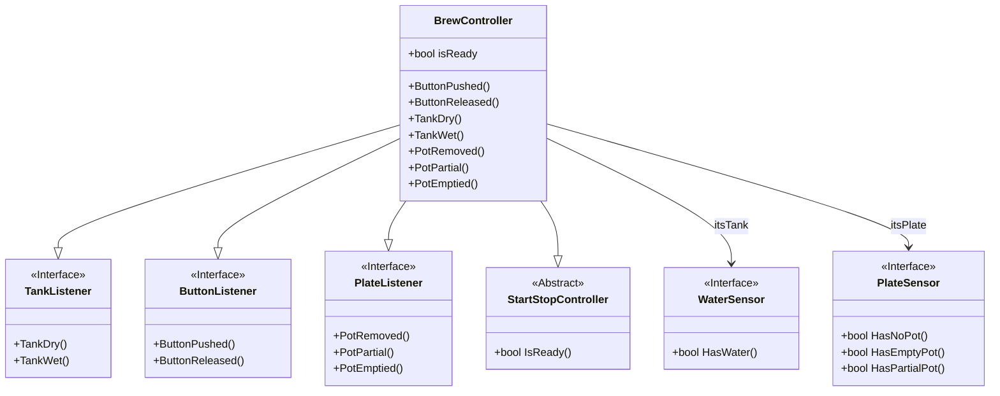

# Hello

another test

This is an [[example backlink]] for GitHub

This is a [normal link](example%20backlink.md)

This is [[another]] test

==Just testing image==:


What about footnotes? [^1]

test

$$
\int_{\Box}^{\Box} \int_{\Box}^{\Box} f(x, y) dx dy
$$

👍

This is a test @serranoMisMemorias2016



```mermaid
stateDiagram-v2
    LocalOrderSearchDone : LocalOrderSearchDone
    LocalOrderSearchDone : Additional comment
    LocalOrderSearchDone --> CheckingLocalData: NextStep [ order_found_locally() ]
    note right of CheckingLocalData
        The order_found_locally condition means:
        - There's an existent placed order in the database.
    end note
    LocalOrderSearchDone --> RequestingMissingData: NextStep

    RequestingMissingData : RequestingMissingData
    RequestingMissingData : Comentario
    state RequestingMissingData {
        N1 : entry / decide_next_execution()
        N1 --> RequestingBasicDetails: RequestBasicDetails [ basic_details_missing() ]
        N1 --> BasicDetailsRequestDone: RequestBasicDetails
        RequestingBasicDetails --> BasicDetailsRequestDone: BasicDetailsRequestDone
    }
```

## References

Here are some references

[^1]: What about it?

[//begin]: # "Autogenerated link references for markdown compatibility"
[example backlink]: <example backlink> "example backlink"
[another]: another "another"
[//end]: # "Autogenerated link references"
