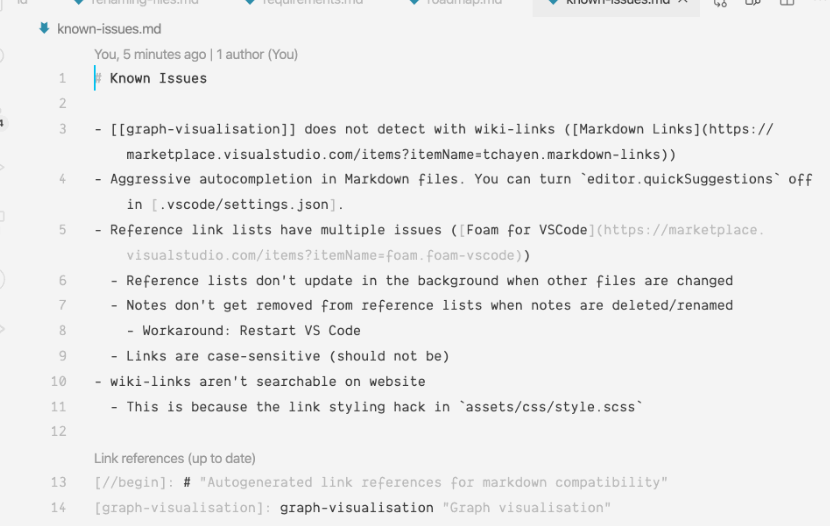

---
bibliography:
    - ../myrefs.bib
output: pdf_document
---  
  
  
#  Hello!
  
  
another test
  
This is an [[example backlink]] for GitHub
  
This is a [normal link](example%20backlink.md )
  
This is [[another]] test
  
Just testing image:
  

  
What about footnotes? [^1]
  
test
  
<p align="center"></p>  
  
  
🤐
  
This is a test @serranoMisMemorias2016
  

```
Error: mermaid CLI is required to be installed.
Check https://github.com/mermaid-js/mermaid-cli for more information.

Error: Command failed: npx -p @mermaid-js/mermaid-cli mmdc --theme default --input C:\Users\aaaaa\AppData\Local\Temp\mume-mermaid20221027-19776-169xc8m.ppdz.mmd --output C:\Users\aaaaa\Syncthing\serranomorante\documents\notes\foam\assets\731a76875af13049c7720d39386004df0.png

ERROR: Failed to set up Chromium r1056772! Set "PUPPETEER_SKIP_DOWNLOAD" env variable to skip download.
[Error: EPERM: operation not permitted, open 'C:\Users\aaaaa\.cache\puppeteer\chrome\chrome-win.zip'] {
  errno: -4048,
  code: 'EPERM',
  syscall: 'open',
  path: 'C:\\Users\\aaaaa\\.cache\\puppeteer\\chrome\\chrome-win.zip'
}
npm ERR! code ELIFECYCLE
npm ERR! errno 1
npm ERR! puppeteer@19.3.0 postinstall: `node install.js`
npm ERR! Exit status 1
npm ERR! 
npm ERR! Failed at the puppeteer@19.3.0 postinstall script.
npm ERR! This is probably not a problem with npm. There is likely additional logging output above.

npm ERR! A complete log of this run can be found in:
npm ERR!     C:\Users\aaaaa\AppData\Roaming\npm-cache\_logs\2022-11-27T07_34_52_989Z-debug.log
Install for [ '@mermaid-js/mermaid-cli@latest' ] failed with code 1

```  

  

  
  
[^1]: What about it?
  
[//begin]: # "Autogenerated link references for markdown compatibility"
[example backlink]: <example backlink> "example backlink"
[another]: another "another"
[//end]: # "Autogenerated link references"
  